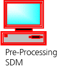
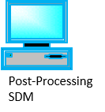

# Run an Election Event in a local Docker Development Environment

***Note:***

- ***The Secure Data Manager must be installed on a Windows machine. An installation on Linux or macOS is currently not supported.***
- ***In order to facilitate the testing in a local development environment this guide simplifies certain configurations.***
- ***All keys, certificates and passwords provided are pregenerated for the purpose of these tests only***
- ***Make sure the system is ready using the ```docker ps``` command to check that all docker containers are healthy***

## Instances of the SDM

Running an Election Event requires three separate instances of the Secure Data Manager (SDM), normally deployed on different machines. To facilitate testing this guide describes how to run a test when all three instances of the SDM are deployed on a single machine:

- **Online SDM**: Instance of the SDM which connects to the voter-portal.


Two instances of the SDM are deployed on airgapped machines:

- **Pre-Processing SDM**: Generates the election event configuration



- **Post-Processing SDM**: Performs the offline mixing and decryption after an election event



## Install the SDM

follow the guide [Install_SDM.md](./Install_SDM.md)

## Day 1

### Start the Pre-Processing SDM


1. Launch the Pre-Processing SDM in ```C:\Users\<USERNAME>\SecureDataManager\PREPROCESSING\Secure Data Manager.exe```

2. Click "**IMPORT**"

3. Select the folder [testdata/sdm/sdm_Post_E2E_DEV](./testdata/sdm/sdm_Post_E2E_DEV)

4. Confirm

### Constitute the Admin Board

***Note: In order to make testing  accessible this guide describes a special configuration for automated E2E Tests where the Smart Cards are simulated and no physical hardware is required. This configuration is activated by the property ```smartcards.profile=e2e``` in ```C:\Users\<USERNAME>\SecureDataManager\<ONLINE|PREPROCESSING|POSTPROCESSING>\sdm\sdmConfig\sdm.properties```***

1. In the Tab Administration Boards select the Administration Board (AB) Post_E2E_DEV and click on "**CONSTITUTE**"

2. Click "**CHOOSE FILE**" and select the file [testdata/sdm/tenant/tenant_100.sks](./testdata/sdm/tenant/tenant_100.sks)

3. Enter the password of the tenant key (see [testdata/sdm/tenant/tenant_PW.txt](./testdata/sdm/tenant/tenant_PW.txt))

4. Click "**OK**"

For every administration board member:

1. Create an empty file ```smart-card.b64``` in ```C:\Users\<USERNAME>\SecureDataManager\PREPROCESSING\sdm\smart-cards```

2. Set a PIN and click "**OK**"

    ***Note: When simulating Smart Cards the PIN has no effect***

3. Rename the file ```smart-card.b64``` to the name of the administration board member (e.g. AB1.b64)

After repeating this process for every administration board member the contents of ```C:\Users\<USERNAME>\SecureDataManager\PREPROCESSING\sdm\smart-cards``` should be: 
- AB1.b64
- AB2.b64

### Election Event Securization

1. Choose the election Event ```Post_E2E_DEV``` in the Election Events Tab

2. Click "**SECURE**".

3. The status of the election event will change to "**Ready**".

### Activate the Administration Board

1. Click on the Election Event ```Post_E2E_DEV```.

2. Click on "**Activate Admin Board**"

For every administration board member:

1. rename the file corresponding to each administration board member (e.g. ```AB1.b64```) in ```C:\Users\<USERNAME>\SecureDataManager\PREPROCESSING\sdm\smart-cards``` to ```smart-card.b64```
2. Type the PIN and click "**OK**"
3. Rename the file ```smart-card.b64``` back to the name of the administration board member (e.g. AB1.b64)

After completing this procedure for every administration board member click "**Activate**"

***Note: The threshold of the number of Administration Board members required to activate the Administration Board is configurable. In order to simplify testing a single member of the Administration Board can activate the Administration Board in the current configuration***

***Note: Repeat this procedure anytime you are asked to activate the admin board***

### Prepare Ballots and Voting Card Sets

1. In the Tab Ballots select all Ballots and click "**SIGN**"

2. In the Tab Voting Card Sets select one Voting Card Set at a time and click "**PRECOMPUTE**". Repeat this for each Voting Card set.

***Note: This process can take some time. Not being able to launch the process for all Voting Card Sets at once is a known issue***

### Export and Transfer to the Online SDM

As soon as all Voting Card Sets appear in the Tab "PRE-COMPUTED":

1. In the Tab Election Events select the Election Event ```Post_E2E_DEV```

2. Click  "**EXPORT**"

3. Select an arbitrary location (for real election events the export and transfer would be performed with USB Sticks)

4. Select all items and type the password of the integration_online.p12 and click "**Export**".

    Note: The password for the integration_online.p12 provided for tests is "222222"

5. Wait until all Data is successfully exported

6. Close the Pre-Processing SDM

### Import Election Event in the Online SDM


1. Launch the Online SDM in ```C:\Users\<USERNAME>\SecureDataManager\ONLINE\Secure Data Manager.exe```

2. Click «**IMPORT**»

3. Select the Election Event Export folder ```sdm_Post_E2E_DEV``` created in the step before

4. Confirm

### Compute Voting Card Sets

1. Select one Voting Card Set at a time in the PRE-COMPUTED tab

2. Click  **COMPUTE** (The status changes to Computing)

3. Repeat the process for each Voting Card Set

***Note: Not being able to launch the process for all Voting Card Sets at once is a known issue***

4. Click **SYNC** repeatedly until all Voting Card Sets appear in the COMPUTED tab.

5. Select all Voting Card Sets

6. Click **DOWNLOAD**

### Export and Transfer to the Pre-Processing SDM

As soon as all Voting Card Sets appear in the Tab "DOWNLOADED":

1. In the Tab Election Events select the Election Event ```Post_E2E_DEV```

2. Click  "**EXPORT**"

3. Select an arbitrary location

4. Select all items and type the password of the integration_online.p12 and click "**Export**".

    Note: The password for the integration_online.p12 provided for tests is "222222"

5. Wait until all Data is successfully exported

6. Close the Online SDM

### Import Election Event in the Pre-Processing SDM


1. Launch the Pre-Processing SDM in ```C:\Users\<USERNAME>\SecureDataManager\PREPROCESSING\Secure Data Manager.exe```

2. Click «**IMPORT**»

3. Select the Election Event Export folder ```sdm_Post_E2E_DEV``` created in the step before

4. Confirm

### Activate the Administration Board (Day 1)

1. Click on the Election Event ```Post_E2E_DEV```.

2. Click on "**Activate Admin Board**"

For every administration board member:

1. rename the file corresponding to each the administration board member (e.g. ```AB1.b64```) in ```C:\Users\<USERNAME>\SecureDataManager\PREPROCESSING\sdm\smart-cards``` to ```smart-card.b64```
2. Type the PIN and click "**OK**"
3. Rename the file ```smart-card.b64``` back to the name of the administration board member (e.g. AB1.b64)

After completing this procedure for every administration board member click "**Activate**"
Generate Voting Card Sets

1. Select all Voting Card Sets in the DOWNLOADED tab

2. Click **GENERATE**

   ***Note: This process can take some time***

3. Select all Voting Card Sets in the "GENERATED" tab and then click SIGN

## Day 2

### Constitute Electoral Authorities

1. In the Tab Electoral Authorities select the Electoral Authority ```Post_E2E_DEV``` and click "**CONSTITUTE**"

   For every electoral board member:

2. Create an empty file ```smart-card.b64``` in ```C:\Users\<USERNAME>\SecureDataManager\PREPROCESSING\sdm\smart-cards```

3. Set a PIN and click "**OK**"

4. Rename the file ```smart-card.b64``` to the name of the administration board member (e.g. EA1.b64)

   After completing this process for every electoral board member the Electoral Authority should gave the status "Ready"

5. Select the Electoral Authority ```Post_E2E_DEV``` and click "**SIGN**"

After repeating this process for every electoral board member the contents of ```C:\Users\<USERNAME>\SecureDataManager\PREPROCESSING\sdm\smart-cards``` should be: 
- AB1.b64
- AB2.b64
- EA1.b64
- EA2.b64

### Sign Ballot Boxes

1. In the tab Ballot Boxes sign all Test Ballot Boxes in the tab READY by selecting them and clicking "**SIGN**"

2. The status of all Ballot Boxes (Regular and Test) should be **SIGNED**

### Export and Transfer to the Online SDM (Day 2)

1. In the Tab Election Events select the Election Event ```Post_E2E_DEV```

2. Click  "**EXPORT**"

3. Select an arbitrary location (for real election events the export and transfer would be performed with USB Sticks)

4. Select all items and type the password of the integration_online.p12 and click "**Export**".

    Note: The password for the integration_online.p12 provided for tests is "222222"

5. Wait until all Data is successfully exported

6. Close the Pre-Processing SDM

### Import Election Event in the Online SDM (Day 2)


1. Launch the Online SDM in ```C:\Users\<USERNAME>\SecureDataManager\ONLINE\Secure Data Manager.exe```

2. Click «**IMPORT**»

3. Select the Election Event Export folder ```sdm_Post_E2E_DEV``` created in the step before

4. Confirm

### Synchronize Election Event

1. Click on the Election Events ```Post_E2E_DEV``` and click **SYNC** in order to synchronize the election event with the voter portal

2. Verify that all elements were successfully synchronized:

- Ballots: Status **SIGNED** and **SYNCHRONIZED**

- Voting Card Sets in the SIGNED tab: Details **SYNCRHONIZED**

- Electoral Authorities: Status **SIGNED** and **SYNCRHONIZED**

- Ballot Boxes in the SIGNED tab: Details **SYNCRHONIZED**

### Submit Votes

1. Open the following URL in your browser: **<http://localhost:7000/vote/#/legal-terms/EEID>**

   ***Note: the EEID is the name of the folder in ```C:\Users\<USERNAME>\SecureDataManager\PREPROCESSING\sdm\config``` e.g. ```dfffc06a3ee249fa9b72584507a55fd3```***

2. Acknowledge the "Legal Terms"

3. In order the authenticate yourself as a voter you will ned the Start Voting Key (```ihhrubtmb3rpchyu6kvg``` in the sample below) and a second factor - in this case the date of birth (```01.06.1944``` in the sample below)

4. You will find the Start Voting Key and Ballot Casting Key needed in step 6 and Vote Cast Code shown in step 7 in ```C:\Users\<USERNAME>\SecureDataManager\PREPROCESSING\sdm\config\<EEID>\ONLINE\printing\<votingCardSetID>\printingData.csv``` 
  
_printingData.csv example (with added column headers)_

5. You will find the second factor (date of birth) in ```C:\Users\<USERNAME>\SecureDataManager\PREPROCESSING\sdm\config\<EEID>\ONLINE\printing\<votingCardSetID>\aliases.csv```

     
   _aliases.csv example (with added column headers)_

6. After making your selection and confirming your choice enter your Ballot Casting Key

7. You will be shown the Vote Cast Code corresponding to this voting card

8. The "submit vote" step can be repeated several times, in-fact doing so ensures the mixing process has to deal with more than the trivial scenario of one vote.  

## Day 3


### Mixing

1. Copy the simulated smart cards of the Administration Board (AB1.b64 and AB2.b64) from ```C:\Users\<USERNAME>\SecureDataManager\PREPROCESSING\sdm\smart-cards``` to ```C:\Users\<USERNAME>\SecureDataManager\ONLINE\sdm\smart-cards```

2. Activate the Administration Board

3. In the Tab Ballot Boxes select all Test Ballot Boxes in the SIGNED tab and Click "**MIX**"

4. Enter Verification Code and Confirm to mix

***Note: This process can take some time***

### Download Ballot Boxes

1. Repeatedly click  **SYNC** until all Ballot Boxes are in the **MIXED** Tab

2. Select all Test Ballot Boxes in the MIXED tab and click **DOWNLOAD**

3. Wait until all Ballot Boxes appear in the DOWNLOADED tab

### Export and Transfer to the Post-Processing SDM

1. In the Tab Election Events select the Election Event ```Post_E2E_DEV```

2. Click  "**EXPORT**"

3. Select an arbitrary location

4. Select all items and type the password of the integration_online.p12 and click "**Export**".

    Note: The password for the integration_online.p12 provided for tests is "222222"

5. Wait until all Data is successfully exported

6. Close the Online SDM

### Import Election Event in the Post-Processing SDM


1. Launch the Post-Processing SDM in ```C:\Users\<USERNAME>\SecureDataManager\POSTPROCESSING\Secure Data Manager.exe```

2. Click «**IMPORT**»

3. Select the Election Event Export folder ```sdm_Post_E2E_DEV``` created in the step before

4. Confirm

### Offline Mixing and Decryption

1. Copy the simulated smart cards of the Administration Board and Electoral Authority from ```C:\Users\<USERNAME>\SecureDataManager\PREPROCESSING\sdm\smart-cards``` to ```C:\Users\<USERNAME>\SecureDataManager\POSTPROCESSING\sdm\smart-cards```

2. Activate the Administration Board

3. In the Ballot Boxes Tab select all Ballot Boxes in the **DOWNLOADED** Tab.

4. Click **DECRYPT**

5. Activate the Electoral Board

#### For every electoral board member

1. Rename the file corresponding to each the electoral board member (e.g. ```EA1.b64```) in ```C:\Users\<USERNAME>\SecureDataManager\POSTPROCESSING\sdm\smart-cards``` to ```smart-card.b64```
2. Type the PIN and click "**OK**"
3. Rename the file ```smart-card.b64``` back to the name of the electoral board member (e.g. EA1.b64)

After completing this procedure for every electoral board member click "**Activate**"

***Note: The threshold of the number of Electoral Board members required to activate the Electoral Authority  is configurable. In order to simplify testing a single member of the Electoral Board can activate the Electoral Authority  in the current configuration***

***Note: This process can take some time***

### Election Results

1. Verify that all Ballot Boxes appear in the DECRYPTED tab

2. Find the list of prime numbers corresponding to the chosen voting options in the file decompressedVotes.csv under ```C:\Users\<USERNAME>\SecureDataManager\POSTPROCESSING\sdm\config\<EEID>\ONLINE\electionInformation\ballots\<ballotID>\ballotBoxes\<ballotBoxID>```

### Cleanup

In order to re-run the election event perform the following steps:

1. Delete the following files and directories:
    - C:\Users\<USERNAME>\SecureDataManager\<ONLINE|PREPROCESSING|POSTPROCESSING>\sdm\smdDB
    - C:\Users\<USERNAME>\SecureDataManager\<ONLINE|PREPROCESSING|POSTPROCESSING>\sdm\logs
    - C:\Users\<USERNAME>\SecureDataManager\<ONLINE|PREPROCESSING|POSTPROCESSING>\sdm\config\csr
    - C:\Users\<USERNAME>\SecureDataManager\<ONLINE|PREPROCESSING|POSTPROCESSING>\sdm\config\platformRootCA.pem
    - C:\Users\<USERNAME>\SecureDataManager\<ONLINE|PREPROCESSING|POSTPROCESSING>\sdm\config\tenant-100-CA.pem
    - C:\Users\<USERNAME>\SecureDataManager\<ONLINE|PREPROCESSING|POSTPROCESSING>\sdm\config\<EEID>
    - C:\Users\<USERNAME>\SecureDataManager\<ONLINE|PREPROCESSING|POSTPROCESSING>\sdm\sdmConfig\elections_config.json
    - C:\Users\<USERNAME>\SecureDataManager\<ONLINE|PREPROCESSING|POSTPROCESSING>\sdm\sdmConfig\elections_config.json.p7
    - C:\Users\<USERNAME>\SecureDataManager\<ONLINE|PREPROCESSING|POSTPROCESSING>\sdm\db_dump.json
    - C:\Users\<USERNAME>\SecureDataManager\<ONLINE|PREPROCESSING|POSTPROCESSING>\sdm\db_dump.json.p7
    - C:\Users\<USERNAME>\SecureDataManager\<ONLINE|PREPROCESSING|POSTPROCESSING>\sdm\smart-cards
    - Any exports created during the event

