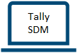

# Run an Election Event in a local Docker Development Environment

**The Secure Data Manager must be installed on a Windows machine. An installation on Linux or macOS is currently not supported.**\
**In order to facilitate the testing in a local development environment this guide simplifies certain configurations.**\
**All keys, certificates and passwords provided are pregenerated for the purpose of these tests only.**\
**Make sure the system is ready using the ```docker ps``` command to check that all docker containers are healthy.**

**Placeholders:**

- USERNAME
- INSTANCE: ConfigSDM | OnlineSDM | TallySDM
- N: Number 1..2

## Instances of the SDM

Running an Election Event requires three separate instances of the Secure Data Manager (SDM), normally deployed on different machines.\
To facilitate testing this guide describes how to run a test when all three instances of the SDM are deployed on a single machine:

- C:\Users\<USERNAME>\SecureDataManager\ConfigSDM\Secure Data Manager.exe
- C:\Users\<USERNAME>\SecureDataManager\OnlineSDM\Secure Data Manager.exe
- C:\Users\<USERNAME>\SecureDataManager\TallySDM\Secure Data Manager.exe

### One instance of the SDM is deployed on a machine connected to the internet:

- Online SDM: Instance of the SDM which connects to the voter-portal


### Two instances of the SDM are deployed on airgapped machines:

- **Config SDM**: Instance of the SDM which generates the Election Event configuration


- **Tally SDM**: Instance of the SDM which performs the offline mixing and decryption after an Election Event



---

## Install the SDM

Follow the guide [Install_SDM.md](./Install_SDM.md)

---

## Day 1

### Config SDM - Import test data:


**Workflow:**
1. Launch the Config SDM in ```C:\Users\<USERNAME>\SecureDataManager\ConfigSDM\Secure Data Manager.exe```
2. Click **IMPORT**
3. Navigate and select the Testdata previously downloaded at: [TESTDATA](./testdata-external/sdm/import-me.sdm)
4. Click **OK**

---

### Config SDM - Constitute the Admin Board

In order to make testing accessible this guide describes a special configuration for automated E2E Tests where the Smart Cards are simulated and no physical hardware is required.\
This configuration is activated by the property ```smartcards.profile=e2e``` in ```C:\Users\<USERNAME>\SecureDataManager\<INSTANCE>\sdm\sdmConfig\sdm.properties```\
The threshold of the number of Administration Board members required to activate the Administration Board is configurable.\
In order to simplify testing a single member of the Administration Board can activate the Administration Board in the current configuration.

1. Click **Administration Boards**
2. Select **Post_E2E_DEV**
3. Click **CONSTITUTE**
4. Click **CHOOSE FILE**
5. Select the [tenant key file](./testdata-external/sdm/tenant/tenant_100.sks)
6. Enter the password of the tenant key (see [tenant_PW.txt](/testdata-external/sdm/tenant/tenant_PW.txt))
7. Click **OK**
8. Navigate to ```C:\Users\<USERNAME>\SecureDataManager\ConfigSDM\sdm\smart-cards```
9. For each member of the Administration Board (e.g. 2 members):
    + Create an empty text file *smart-card.b64*
    + Enter a PIN (*e.g. "222222" - When simulating Smart Cards the PIN has no effect*)
    + Click **OK**
    + Rename the file ```smart-card.b64``` to ```AB<N>.b64``` (*e.g. AB1.b64, AB2.b64*)
10. The directory ```C:\Users\<USERNAME>\SecureDataManager\ConfigSDM\sdm\smart-cards``` shall contain:
-  *AB1.b64*
-  *AB2.b64*

---

### Config SDM - Secure the Election Event

**Workflow:**
1. Click **Election Events**
2. Select ```Post_E2E_DEV```
3. Click **SECURE**
4. The status of the Election Event will change to **Ready**

---

### Config SDM - Activate the Administration Board

**Workflow:**
1. Click **Dashboard**
2. Click **Activate Administration Board**
3. Navigate to ```C:\Users\<USERNAME>\SecureDataManager\ConfigSDM\sdm\smart-cards```
4. For each member of the Administration Board:
    + Rename the corresponding ```AB<N>.b64``` file to ```smart-card.b64```
    + Enter the PIN (*e.g. "222222"*)
    + Click **OK**
    + Rename the file ```smart-card.b64``` back to ```AB<N>.b64``` (*e.g. AB1.b64, AB2.b64*)
5. For each member of the Administration Board:
    + Click **ACTIVATE**

---

### Config SDM - Prepare Ballot and Voting Card Sets

**Workflow:**
1. Click **Ballots**
2. **Select all Ballots**
3. Click **SIGN**
4. Click **Voting Card Sets**
5. Click **LOCKED**
6. **Select all Voting Card Sets**
7. Click **PRECOMPUTE** (*The status changes to "Pre-computing" - This process can take some time*)
8. Click **SYNC** repeatedly until all Voting Card Sets appear under **PRE-COMPUTED**

---

### Config SDM - Export Election Event

For real Election Events the export and transfer would be performed with USB Sticks.

**Workflow:**
1. Click **Election Events**
2. Select **Post_E2E_DEV**
3. Click **EXPORT**
4. Select an arbitrary location for the Election Event, e.g. ```C:\Users\<USERNAME>\Export1```
5. **Select all items**
6. Enter the password of the ```integration_online.p12``` (*The password for the integration_online.p12 provided for tests is "222222"*)
7. Click **EXPORT**
8. Wait until all data has successfully been exported
9. Close the Config SDM

---

### Online SDM - Import Election Event


**Workflow:**
1. Launch the Online SDM in ```C:\Users\<USERNAME>\SecureDataManager\OnlineSDM\Secure Data Manager.exe```
2. Click **IMPORT**
3. Select the Election Event previously exported to ```C:\Users\<USERNAME>\Export1```
4. Click **OK**

---

### Online SDM - Request and import the CC-Keys

This function provides the public keys of the control components. 
These keys are crucial for verifiability and privacy protection in the cryptographic protocol.

**Workflow:**
1. Select your election event in the SDM.	
2. Click on **REQUEST CC KEYS** to start the import.
3. Wait for successful confirmation by the SDM.

---

### Online SDM - Compute Voting Card Sets

**Workflow:**
1. Click **Voting Card Sets**
2. Click **PRE-COMPUTED**
3. **Select all Voting Card Sets**
4. Click **COMPUTE** (*The status changes to "Computing" - This process can take some time*)
5. Click **SYNC** repeatedly until all Voting Card Sets appear under **COMPUTED**
6. **Select all Voting Card Sets**
7. Click **DOWNLOAD**
8. All Voting Card Sets has been moved to **DOWNLOADED**

---

### Online SDM - Export Election Event

**Workflow:**
1. Click **Election Events**
2. Select ```Post_E2E_DEV```
3. Click **EXPORT**
4. Select an arbitrary location for the Election Event, e.g. ```C:\Users\<USERNAME>\Export2```
5. **Select all items**
6. Enter the password of the ```integration_online.p12```(*The password for the integration_online.p12 provided for tests is "222222"*)
7. Click **EXPORT**
8. Wait until all data has successfully been exported
9. Close the Online SDM

---

### Config SDM - Import Election Event


**Workflow:**
1. Launch the Config SDM in ```C:\Users\<USERNAME>\SecureDataManager\ConfigSDM\Secure Data Manager.exe```
2. Click **IMPORT**
3. Select the Election Event previously exported to ```C:\Users\<USERNAME>\Export2```
4. Click **OK**

---

### Config SDM - Compute Voting Card Sets

**Workflow:**
1. Click **Voting Card Sets**
2. Click **DOWNLOADED**
3. **Select all Voting Card Sets**
4. Click **GENERATE**
5. All Voting Card Sets has been moved to **GENERATED**
6. Click **GENERATED**
7. **Select all Voting Card Sets**
8. Click **SIGN**
9. All Voting Card Sets are now under **SIGNED**

---

## Day 2

### Config SDM - Constitute Electoral Authorities

**Workflow:**
1. Click **Election Events**
2. Select **Post_E2E_DEV**
3. Click **Dashboard**
4. Click **Electoral Authorities**
5. Select the Electoral Authority *Post_E2E_DEV*
6. Click **CONSTITUTE**
7. Navigate to ```C:\Users\<USERNAME>\SecureDataManager\ConfigSDM\sdm\smart-cards```
8. For each member of the Electoral Authorities:
    + Rename the corresponding ```EA<N>.b64``` file to ```smart-card.b64```
    + Enter the PIN (*e.g. "222222"*)
    + Click **OK**
    + Rename the file ```smart-card.b64``` back to ```EA<N>.b64``` (*e.g. EA1.b64, EA2.b64*)
9. Select the Electoral Authority **Post_E2E_DEV**
10. Click **SIGN**
11. The directory ```C:\Users\<USERNAME>\SecureDataManager\ConfigSDM\sdm\smart-cards``` shall contain:
    + AB1.b64
    + AB2.b64
    + EA1.b64
    + EA2.b64

---

### Config SDM - Sign Test Ballot Boxes

**Workflow:**
1. Click **Ballot Boxes**
2. Click **READY**
3. **Select all Ballot Boxes** (*Regular and Test Ballot Boxes*)
4. Click **SIGN**
5. All Ballot Boxes are now under **SIGNED**

---

### Config SDM - Export Election Event and Transfer to the Online SDM

**Workflow:**
1. Click **Election Events**
2. Select **Post_E2E_DEV**
3. Click **EXPORT**
4. Select an arbitrary location for the Election Event, e.g. ```C:\Users\<USERNAME>\Export3```
5. **Select all items**
6. Enter the password of the ```integration_online.p12``` (*The password for the integration_online.p12 provided for tests is "222222"*)
7. Click **EXPORT**
8. Wait until all data has successfully been exported
9. Close the Config SDM

---

### Online SDM - Import Election Event in the Online SDM


**Workflow:**
1. Launch the Online SDM in ```C:\Users\<USERNAME>\SecureDataManager\OnlineSDM\Secure Data Manager.exe```
2. Click **IMPORT**
3. Select the Election Event previously exported to ```C:\Users\<USERNAME>\Export3```
4. Click **OK**

---

### Online SDM - Synchronize Election Event

**Workflow:**
1. Click **Election Events**
2. Select **Post_E2E_DEV**
3. Click **SYNC** (*in order to synchronize the Election Event with the voter portal*)
4. Verify that all elements were successfully signed and synchronized:
    + Ballots
    + Voting Card Sets
    + Electoral Authorities
    + Ballot Boxes

---

### Online SDM - Submit Votes

The Election Event ID EEID is a hex number, e.g. ```dfffc06a3ee249fa9b72584507a55fd3```
The current FEID corresponds to the folder name in ```C:\Users\<USERNAME>\SecureDataManager\ConfigSDM\sdm\config```

The voter needs 4 values:
1. Start Voting Key: Initializing (e.g. ihhrubtmb3rpchyu6kvg)
2. Ballot Casting Key: Confirmation
3. Vote Cast Code: Finalisation
4. Year of birth or date of birth: 2nd factor (e.g. 01.06.1944)

The first 3 values can be found in ```C:\Users\<USERNAME>\SecureDataManager\ConfigSDM\sdm\config\<EEID>\OnlineSDM\printing\<votingCardSetID>\printingData.csv:```\
  

The 4th value can be found in ```C:\Users\<USERNAME>\SecureDataManager\ConfigSDM\sdm\config\<EEID>\OnlineSDM\printing\<votingCardSetID>\aliases.csv:```\
  

---

**Workflow:**
1. Open the following URL in your browser: http://localhost:7000/vote/#/legal-terms/EEID
2. Acknowledge the **Legal Terms**
3. In order the authenticate yourself as a voter enter:
    + the **Start Voting Key**
    + the **date of birth**
4. Make your selection
5. Confirm your choice with your **Ballot Casting Key**
6. Your **Vote Cast Code** will shown
7. Compare it with the one on your voting card
8. Submit your vote 

---

## Day 3


### Online SDM - Mixing the Ballot Boxes

**Workflow:**
1. Click **Ballot Boxes**
2. Click **SIGNED**
3. Select all Ballot Boxes (*Regular and Test Ballot Boxes*)
4. Click **MIX**
5. **Enter the shown Verification Code**
6. Click **OK** (*This process can take some time*)
7. Click **UPDATE MIXING STATUS** repeatedly until all Ballot Boxes appear under **MIXED**

---

### Online SDM - Download the Ballot Boxes

**Workflow:**
1. Click **Ballot Boxes**
2. Click **MIXED**
3. Select all Ballot Boxes (*Regular and Test Ballot Boxes*)
4. Click **DOWNLOAD**
5. Wait until all Ballot Boxes appear under **DOWNLOADED**

---

### Online SDM - Export and Transfer the Election Event to the Post-Processing SDM

**Workflow:**
1. Click **Election Events**
2. Select **Post_E2E_DEV**
3. Click **EXPORT**
4. Select an arbitrary location for the Election Event, e.g. ```C:\Users\<USERNAME>\Export4```
5. **Select all items**
6. Enter the password of the ```integration_online.p12``` (*The password for the integration_online.p12 provided for tests is "222222"*)
7. Click **EXPORT**
8. Wait until all data has successfully been exported
9. Close the Online SDM

---

### Tally SDM - Import Election Event


**Workflow:**
1. Launch the Tally SDM in ```C:\Users\<USERNAME>\SecureDataManager\TallySDM\Secure Data Manager.exe```
2. Click **IMPORT**
3. Select the Election Event previously exported to ```C:\Users\<USERNAME>\Export4```
4. Click **OK**

---

### Tally SDM - Activate the Administration Board

**Workflow:**
1. Copy the simulated smart cards of the Administration Board and Electoral Authority from
    + C:\Users\<USERNAME>\SecureDataManager\ConfigSDM\sdm\smart-cards to
    + C:\Users\<USERNAME>\SecureDataManager\TallySDM\sdm\smart-cards
2. Click **Dashboard**
3. Click **Activate Administration Board**
4. Navigate to ```C:\Users\<USERNAME>\SecureDataManager\TallySDM\sdm\smart-cards```
5. For each member of the Administration Board:
    + Rename the corresponding ```AB<N>.b64``` file to ```smart-card.b64```
    + Enter the PIN (*e.g. "222222"*)
    + Click **OK**
    + Rename the file ```smart-card.b64``` back to ```AB<N>.b64``` (*e.g. AB1.b64, AB2.b64*)
6. For each member of the Administration Board:
    + Click **ACTIVATE**

---

### Tally SDM - Offline Mixing and Decryption

**Workflow:**
1. Click **Ballot Boxes**
2. Click **DOWNLOADED**
3. **Select all Ballot Boxes**
4. Click **DECRYPT**
5. Navigate to ```C:\Users\<USERNAME>\SecureDataManager\TallySDM\sdm\smart-cards```
6. For each member of the Electoral Authorities:
    + Rename the corresponding ```EA<N>.b64``` file to ```smart-card.b64```
    + Enter the PIN (*e.g. "222222"*)
    + Click **OK**
    + Rename the file ```smart-card.b64``` back to ```EA<N>.b64``` (*e.g. EA1.b64, EA2.b64*)
7. Select the Electoral Authority **Post_E2E_DEV**
8. Wait until all data has successfully been decrypted

---

### Tally SDM - Election Results

The list of prime numbers corresponding to the chosen voting options can be found in the file decompressedVotes.csv under
```C:\Users\<USERNAME>\SecureDataManager\TallySDM\sdm\config\<EEID>\OnlineSDM\electionInformation\ballots\<ballotID>\ballotBoxes\<ballotBoxID>```

**Workflow:**
1. Click **DECRYPTED**
2. Verify that all Ballot Boxes appear

---

## Day 4

### Cleanup
In order to re-run the Election Event a cleanup of the previous Election Event is needed.

**Workflow:**
For each SDM instance <INSTANCE> (ConfigSDM, OnlineSDM, TallySDM) delete following files and directories:
- C:\Users\<USERNAME>\SecureDataManager\<INSTANCE>\config\*.*
- C:\Users\<USERNAME>\SecureDataManager\<INSTANCE>\db_dump.json
- C:\Users\<USERNAME>\SecureDataManager\<INSTANCE>\db_dump.json.p7
- C:\Users\<USERNAME>\SecureDataManager\<INSTANCE>\integration\electionEvents
- C:\Users\<USERNAME>\SecureDataManager\<INSTANCE>\logs
- C:\Users\<USERNAME>\SecureDataManager\<INSTANCE>\sdmConfig\elections_config.json
- C:\Users\<USERNAME>\SecureDataManager\<INSTANCE>\sdmConfig\elections_config.json.p7
- C:\Users\<USERNAME>\SecureDataManager\<INSTANCE>\smdDB
